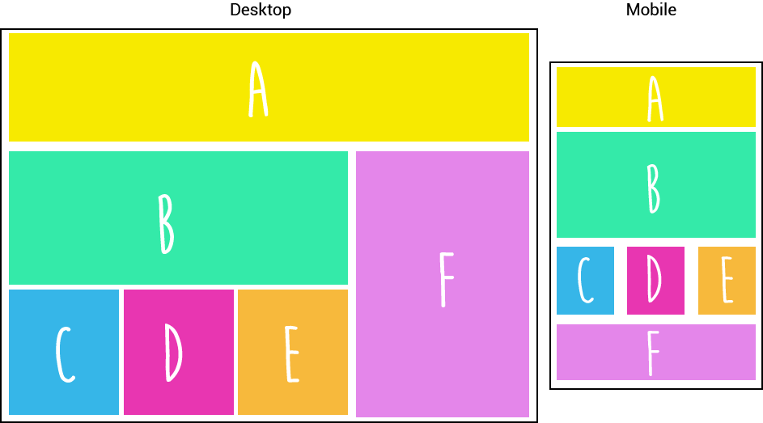

## 2. DE DESKTOP A MOBILE
Ahora que ya sabes hacer una grid en desktop, vamos a hacer un reto más divertido. Te damos tres retos, en cada imagen vas a ver dos versiones: desktop (a la izquierda ) y mobile (a la derecha).

Replica la estructura desktop y modifícala a mobile como la imagen te lo dice, ¡tú puedes!

